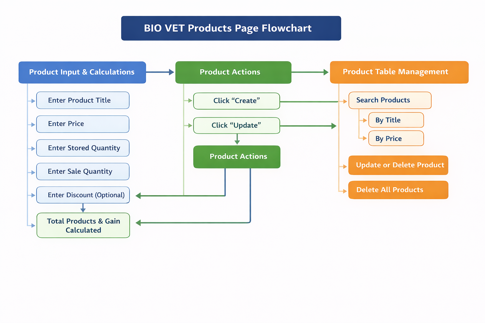
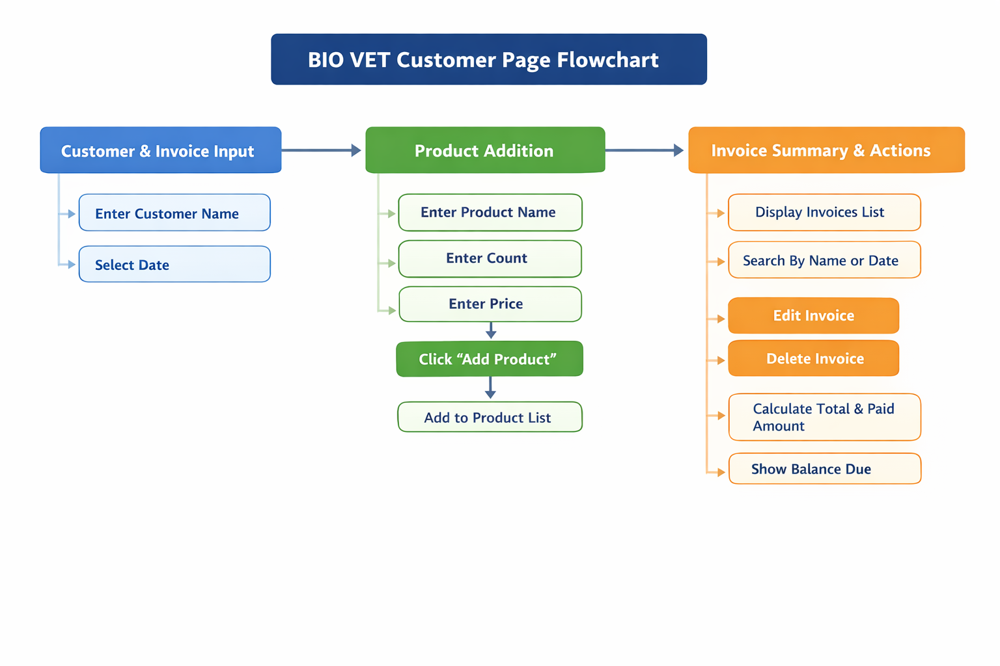

# 🏥 BIO VET - Veterinary Management System


**BIO VET** is a comprehensive, modern veterinary management system designed to streamline operations for veterinary clinics and businesses. It provides an intuitive interface for managing product inventory, customer relationships, and sales transactions with ease.

---

## 📋 Table of Contents

- [About](#about)
- [Key Features](#-key-features)
- [Products Management](#-products-management-system)
- [Customers Management](#-customers-management-system)
- [Technology Stack](#-technology-stack)
- [Project Structure](#-project-structure)
- [Getting Started](#-getting-started)
- [Usage Guide](#usage-guide)
- [Browser Compatibility](#-browser-compatibility)
- [SEO Optimization](#-seo-optimization)
- [Limitations](#-limitations)
- [Tips & Best Practices](#-tips--best-practices)
- [Author](#-author)
- [License & Credits](#-license--credits)

---

## About

Built with a focus on user experience and efficiency, **BIO VET** empowers veterinary professionals to:

- Maintain accurate records
- Manage stock levels
- Track customer interactions seamlessly
- Generate invoices and sales reports

No server required! Everything is stored locally in your browser using LocalStorage.

---

## ✨ Key Features

| Feature                    | Description                                                                                    |
| -------------------------- | ---------------------------------------------------------------------------------------------- |
| 📦 **Product Management**  | Add, edit, delete, and manage veterinary products with complete pricing and inventory tracking |
| 👥 **Customer Management** | Maintain comprehensive customer profiles, track invoices, and manage relationships             |
| 🔍 **Advanced Search**     | Find products by title/price and customers by name/date with instant filtering                 |
| 🌓 **Dark/Light Mode**     | Switch between themes with automatic preference persistence                                    |
| 💾 **Local Storage**       | Secure data storage in browser with no server dependency                                       |
| 📱 **Responsive Design**   | Works seamlessly on desktop, tablet, and mobile devices                                        |

---

## 🛒 Products Management System

Efficiently manage your veterinary product inventory with detailed pricing and sales analytics.

### Features Overview:

- ✅ Add products with title, price, quantity, and discount
- ✅ Real-time calculations for total products and profit gains
- ✅ Edit and delete products instantly
- ✅ Smart search by title or price
- ✅ Complete table view of all products

### 📊 User Interaction Workflow

1. **Navigate to Products** - Click "Go to products page" from home
2. **Enter Product Details** - Fill in title, price, stored qty, sale qty, discount
3. **View Calculations** - System auto-calculates remaining products and profit
4. **Add to Inventory** - Click "create" to add to table
5. **Search Products** - Use search bar for instant filtering
6. **Edit/Delete** - Modify or remove products as needed



---

## 👥 Customers Management System

Maintain detailed customer records, process invoices, and track all transactions in one place.

### Features Overview:

- ✅ Create invoices with multiple products
- ✅ Store customer names and transaction dates
- ✅ Dynamically add items to invoices
- ✅ Track total price, paid amount, and balance
- ✅ View, edit, and delete invoices
- ✅ Search by customer name or date

### 📝 User Interaction Workflow

1. **Navigate to Customers** - Click "Go to customers page" from home
2. **Enter Customer Details** - Input name and transaction date
3. **Add Invoice Items** - Enter product name, quantity, price
4. **Click Add Button** - Add products to invoice (repeat for multiple items)
5. **Enter Payment Info** - Set total price and paid amount
6. **Create Invoice** - Click "create" to save
7. **Search Invoices** - Find by customer name or date
8. **Manage Records** - Edit or delete invoices



---

## 🛠️ Technology Stack

- **HTML5** - Semantic markup
- **CSS3** - Modern styling with gradients and animations
- **JavaScript (Vanilla)** - No frameworks, pure ES6+
- **LocalStorage API** - Client-side data persistence
- **Font Awesome 7.0.0** - Professional icons
- **Responsive Design** - Mobile-first approach

---

## 📁 Project Structure

```
BIO VET/
├── index.html                 # Home page with landing cards
├── sitemap.xml               # SEO sitemap
├── robots.txt                # Search engine directives
├── README.md                 # Documentation
│
├── assets/
│   └── images/              # Project images and logo
│       ├── logo.jpg
│       ├── products-user-interaction.png
│       └── customers-user-interaction.png
│
├── styles/
│   ├── style.css             # Global styles and themes
│   └── index.css             # Home page specific styles
│
├── js/
│   └── main.js               # Theme toggle functionality
│
└── features/
    ├── products/
    │   ├── products.html      # Products management page
    │   ├── styles/
    │   │   └── products.css   # Product page styles
    │   └── js/
    │       └── products.js    # Product CRUD operations
    │
    └── customers/
        ├── customers.html     # Customers management page
        ├── styles/
        │   └── customers.css  # Customer page styles
        └── js/
            └── customers.js   # Customer CRUD operations
```

---

## 🚀 Getting Started

### Installation:

1. Clone or download the BIO VET project

   ```bash
   git clone https://github.com/yourusername/biovet.git
   cd biovet
   ```

2. Extract the files to your desired location

3. Open `index.html` in your web browser

   ```bash
   # On Windows
   start index.html

   # On macOS
   open index.html

   # On Linux
   xdg-open index.html
   ```

4. **No server or additional setup required!**

### Usage Guide:

1. **Landing Page** - Start at home page with two navigation cards
2. **Products Page** - Manage inventory with complete CRUD operations
3. **Customers Page** - Create and manage customer invoices
4. **Theme Toggle** - Click sun/moon icon to switch themes (saved automatically)
5. **Data Persistence** - All data auto-saves to browser's local storage

---

## ⚡ Key Interactions

### Search Functionality:

- **Products**: Search by title or price in real-time
- **Customers**: Search by name or invoice date instantly
- Case-insensitive search for better UX

### Theme Switching:

- Click the sun/moon icon in top-right corner
- Your preference is automatically saved
- Smooth transitions between dark and light themes

### Data Management:

- All data stored in browser's LocalStorage
- Data persists across browser sessions
- Delete individual items or clear all at once

---

## 🌐 Browser Compatibility

BIO VET works on all modern browsers supporting ES6 JavaScript and LocalStorage:

| Browser         | Support                      |
| --------------- | ---------------------------- |
| Chrome/Edge     | ✅ Latest versions           |
| Firefox         | ✅ Latest versions           |
| Safari          | ✅ Latest versions           |
| Mobile Browsers | ✅ iOS Safari, Chrome Mobile |

---

## 🔍 SEO Optimization

BIO VET is built with SEO best practices in mind:

### Meta Tags:

- ✅ **Title Tags** - Descriptive page titles for each section
- ✅ **Meta Descriptions** - Clear descriptions for search engine snippets
- ✅ **OG Tags** - Open Graph tags for social media sharing
- ✅ **Twitter Cards** - Twitter-specific meta tags for better sharing
- ✅ **Canonical URLs** - Prevent duplicate content issues
- ✅ **Robots Meta** - `index, follow` directive for search engines

### Sitemap & Robots:

- ✅ **sitemap.xml** - Complete URL structure for search engines
- ✅ **robots.txt** - Crawl directives and sitemap reference
- ✅ **Semantic HTML** - Proper heading hierarchy (h1, h2, h3)
- ✅ **Mobile Friendly** - Responsive design for mobile indexing
- ✅ **Page Speed** - Lightweight assets and optimized loading
- ✅ **Structured Data** - Clear content organization

### Keywords:

- Veterinary Management System
- Product Inventory Management
- Customer Invoice Management
- CRUD Operations
- Local Business Management

---

## ⚠️ Limitations

Before using BIO VET for large-scale operations, be aware of these limitations:

### LocalStorage Constraints:

- **Storage Limit**: Typically **5-10 MB** per domain (varies by browser)
- **Invoice/Product Limit**: Can handle approximately **1,000-2,000 invoices** depending on data size
- **Not Suitable For**: Large veterinary chains with thousands of daily transactions
- **Data Format**: No compression - raw data storage counts toward limit

### Recommendations for Large Operations:

- ✅ For large datasets, consider migrating to **IndexedDB** (much larger storage ~50MB+)
- ✅ Implement **periodic data export** to backup files
- ✅ Archive old invoices regularly to maintain performance
- ✅ Use external backend database for enterprise-scale operations

### Current Limitations:

- **No Real-time Sync**: Data is local only, not synced across devices
- **No User Authentication**: Single-user application without login system
- **No Cloud Backup**: Data lost if browser cache/cookies are cleared
- **No Multi-device Sync**: Each device maintains separate data
- **No Advanced Reporting**: Limited to basic search and table views
- **No API Integration**: Standalone application without external integrations

### Performance Considerations:

- Large datasets (1000+ records) may cause slower search/filter operations
- Recommended to clear completed invoices periodically
- Export data backup at least monthly for safety

---

## 💡 Tips & Best Practices

- **Regular Backups** - Periodically export your data to prevent loss
- **Clear Cache** - If experiencing issues, clear cache and reload
- **Descriptive Names** - Use detailed product and customer names for easy searching
- **Verify Calculations** - Check automatic calculations before finalizing transactions
- **Keep Organized** - Remove obsolete entries regularly

---

## �‍💻 Author

**BIO VET Development Team**

- **Project**: BIO VET - Veterinary Management System
- **Version**: 1.0.0
- **Release Date**: December 2025
- **Last Updated**: December 16, 2025

### Contact & Support:

For inquiries, bug reports, or feature requests, please reach out through:

- GitHub Issues
- Project Repository
- Direct Feedback Form

---

## 📄 License & Credits

**BIO VET** © 2025. All rights reserved.

### Credits:

- **Icons**: [Font Awesome 7.0.0](https://fontawesome.com)
- **Fonts**: System UI fonts for optimal performance
- **Development**: Built with modern web technologies
- **Architecture**: Client-side only, no server dependencies
- **Data Storage**: Browser LocalStorage API

---

## 🤝 Support & Contribution

We welcome feedback and contributions! If you encounter issues or have feature suggestions:

- Report bugs or suggest features
- Contribute code improvements
- Share feedback on user experience
- Help improve documentation

---

<div align="center">

**Made with ❤️ for Veterinary Professionals**

[⬆ Back to top](#-biovet---veterinary-management-system)

</div>